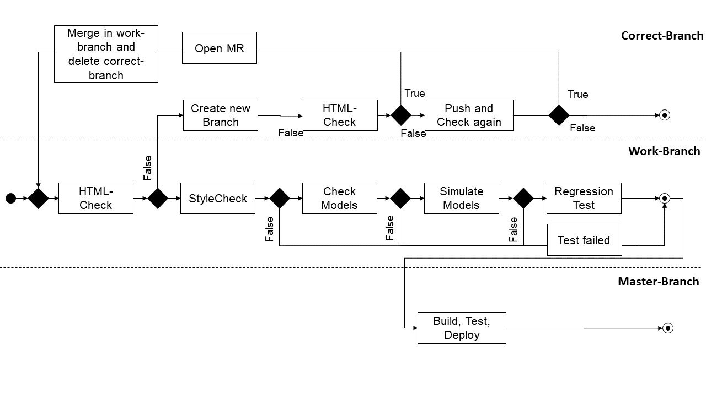
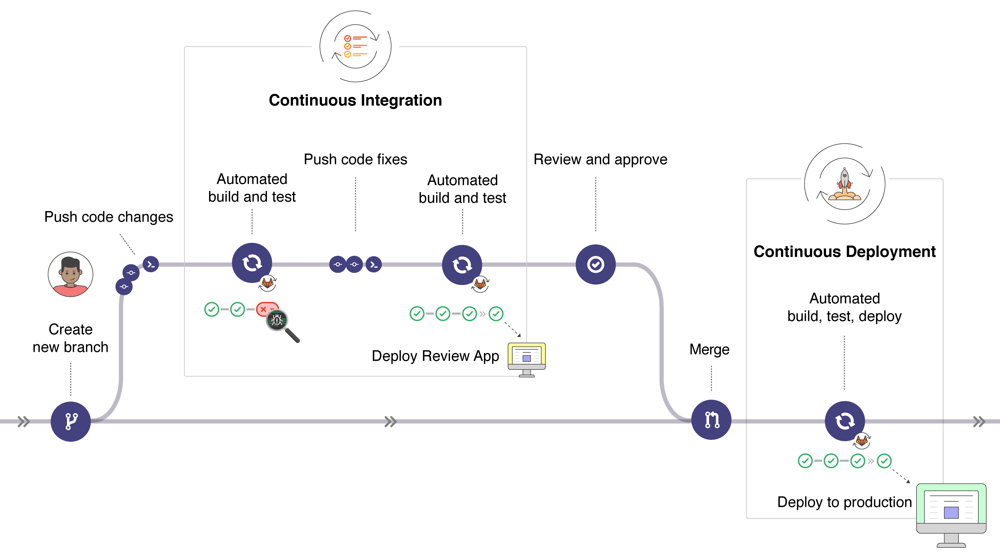
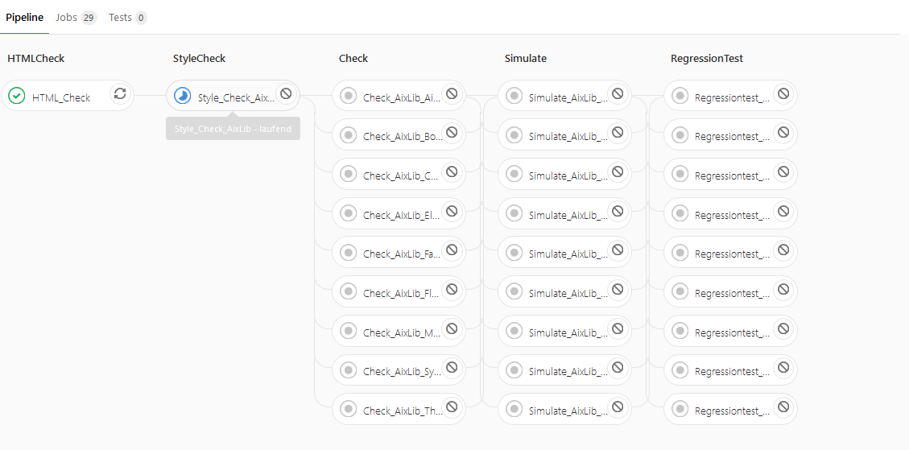

# Here you find the Documentation for the CI Test for AixLib
## What is it?
At this time are five different Checks implemented. 

## What is implement?

## CleanUpScripts
 
### cleanmodelica

This script deletes following files:

	'buildlog.txt', 'dsfinal.txt', 'dsin.txt', 'dslog.txt', 
	'dsmodel*', 'dymosim', 'dymosim.lib', 'dymosim.exp', 
	'dymosim.dll', 'dymola.log', 'dymosim.exe', '*.mat', '*.mof', 
	'*.bak-mo', 'request.', 'status.', 'status', 'failure', 
	'success.','stop', 'stop.','fmiModelIdentifier.h', 'modelDescription.xml',
	'fmiFunctions.o', 'CSVWriter.csvWriter.csv', 'test.csv',

You can use it for deploy your Library.
## SyntaxTests
This folder evaluated and correct the code in the AixLib. 

### html_tidy_errors.py
At this point the HTML code in the Aixlib modelica Models is corrected.
Additionally the code is corrected  the HTML Code to the HTML5 syntax. This include following Warning and Errors: 

	Warning: 
 attribute "align" not allowed for HTML5
	Warning:  element removed from HTML5
	Warning: <th> attribute "align" not allowed for HTML5

The error message 

	Warning: The summary attribute on the <table> element is obsolete in HTML5 

is ignored and will be implemented in the future
	
   
If the test was not successfull, CI creates a new branch and push the corrected code to the new branch. 
For this process you have to create new variables in your repository.

For the implementation of the html_tidy errors.py the following step must be done.

#### $GL_TOKEN
1. Log in to GitLab.
2. In the upper-right corner, click your avatar and select Settings.
3. On the User Settings menu, select Access Tokens.
4. Choose a name and optional expiry date for the token.
5. Choose the desired scopes.
6. Click the Create personal access token button.
7. Save the personal access token somewhere safe. Once you leave or refresh the page, you won’t be able to access it again

[Create a GL_TOKEN](https://docs.gitlab.com/ce/user/profile/personal_access_tokens.html#creating-a-personal-access-token)

$TARGET_BRANCH: Your current work branch.

### StyleChecking.py

This Script evaluated the documentation of the AixLib Models in dymola. The script operated with the ModelManagement in Dymola. 

To work with this Script type following Command:

	python bin/CITests/SyntaxTests/StyleChecking.py -s "AixLib" -p AixLib/package.mo 

At this time the models are not up to date to pass the tests StyleCheck successfully. Therefore the tests are only applied to new models in the short term to ensure that the styles are correct and correspond to the settings.
In the future, the models that fail the test will have to be revised and adapted.
If the Test failed, Gitlab export two log files with a errorlist.

## UnitTests
Scripts that simulate and validate modelica models using dymola	

### runUnitTests.py
The regression test is implemented with the following command:	
	-  cd AixLib && python ../bin/02_CITests/UnitTests/runUnitTests.py -n 2 --single-package AixLib.Airflow --tool dymola
Further information can be found under the following [link](https://git.rwth-aachen.de/sven.hinrichs/GitLabCI/-/blob/master/bin/04_Documentation/How_to_integrate_new_tests.md) and explains among other things how to create new UnitTests.

### validatetest.py
This test checks the models and simulates the packages "examples" and "validations". 

The following command is used to check the models:
	- python bin/02_CITests/UnitTests/CheckPackages/validatetest.py -s "AixLib.Airflow" -p AixLib/package.mo 

A whitelist of IBPSA models was created. The list contains all models of the IBPSA library that have not passed the CheckTest. These models are ignored during the test and are therefore sorted out before the test. 
To keep the white list up to date, it should be updated regularly. This is done using the tag --WhisteList

## Overall process

The entire CI test looks as follows.

# What is done?

- Simulate Modeles
- Check Models
- Regression test of models
- HTML Check and Correction
- Check the style of modelica models

