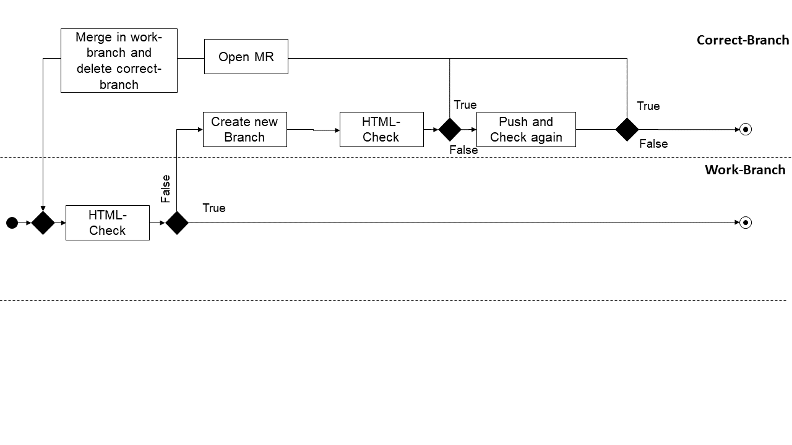

# What is it?
This templates check, simulate and make a regression test of the AixLib models.

# How to implement?
To integrate the tests in the GitLab-CI  include the templates.
Add the following lines to your .gitlab-ci.yml:

	#!/bin/bash
	image: registry.git.rwth-aachen.de/ebc/ebc_intern/dymola-docker:miniconda-latest

	stages:
		- build
		- HTMLCheck
		- openMR
		- deploy
		- StyleCheck
		
	include:
		- project: 'EBC/EBC_all/gitlab_ci/templates'
		- file: 'ci-tests/SyntaxTests/html_check.gitlab-ci.yml'
		- project: 'EBC/EBC_all/gitlab_ci/templates'
		- file: 'ci-tests/SyntaxTests/style_check.gitlab-ci.yml'
'	

### html_tidy_errors	

The Test html_tidy_errors.py validate and correct the HTML code. If the Test failed, it will be
create a new branch and the test repeat. The corrected Version is pushed to the new branch and will create a Merge-Request to
your working-branch.   

You have following options:
	
	1. --correct-backup: 

The library will be overwrite and write a Backup of the Library. 

	2.  --correct-overwrite: 
	
The Script will just overwrite the Library without create a Backup.
	
	3.  --log:

The Script will write a Log File with all Errors and Warning by validate the library.
 
    4. -p (path) 
	
Chose which Library, Package or Model will be checked. 

	5. --align

This tag will correct align Warning. By Default this tag is false and will not fail the test.	
	
	6. --font

This tag will correct font Warning. By Default this tag is false and will not fail the test.	

	7. --WhiteList
	
Create a new WhiteList with all models in Library. These models will not be checked.

	8. --correct-view
	
Reads and validate the html code. Does not change the html code

Add the following command to your .gitlab-ci.yml. 

    - python bin/02_CITests/SyntaxTests/html_tidy_errors.py -p "AixLib" --correct-overwrite --log  --align --font

For more information look at following [Repository](https://github.com/RWTH-EBC/HTML-Tidy-Modelica)

For more help type the command python bin/02_CITests/SyntaxTests/html_tidy_errors.py --help

### StyleChecking

The test StyleChecking use the ModelManagement library in modelica. The script tests the syntax of models or library.

	- python bin/02_CITests/SyntaxTests/StyleChecking.py -s "AixLib" -p AixLib/package.mo

The following option will be checked:

For more help type the command: 

	- python bin/02_CITests/SyntaxTests/StyleChecking.py --help

	

	
# What is done?
- Check and correct HTML code
- Create a new branch
- Produce a Merge-Request
- Push the corrected code to your branch
- Check the style of models

