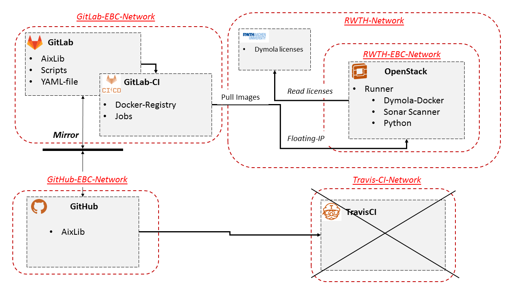
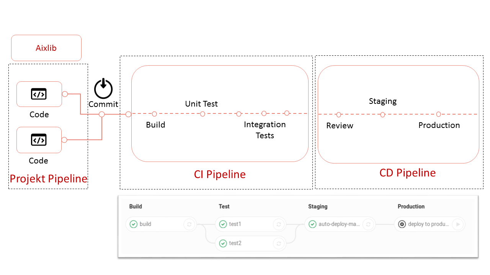
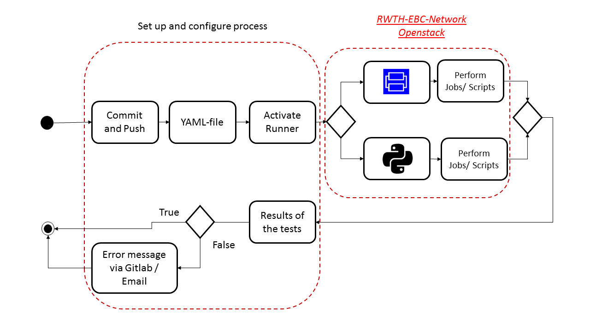
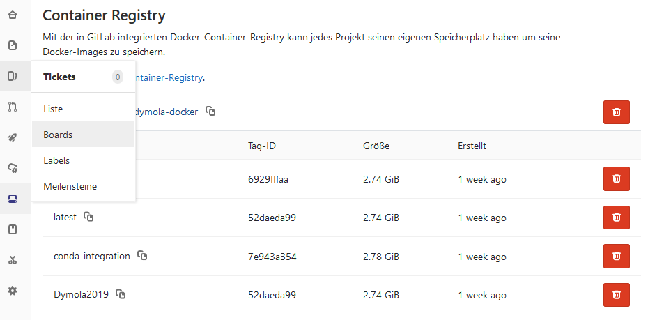
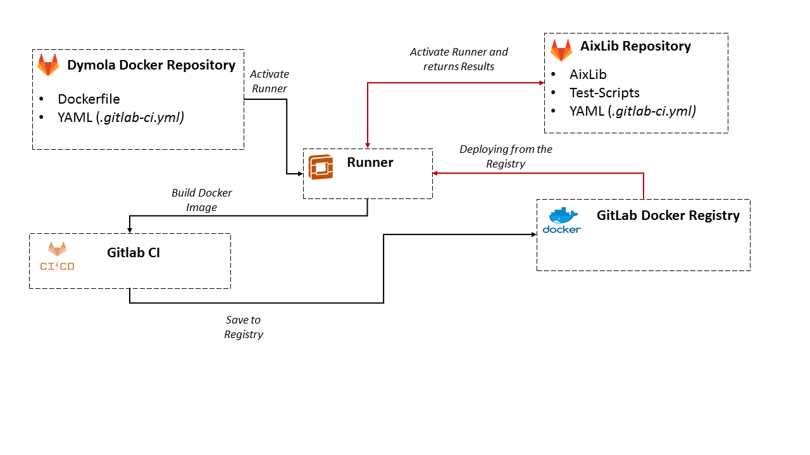

Dymola-Docker
======

The goal of this documentation and the repository is to provide a Dymola docker image to perform CI tests such as UnitTests 
or .mos scripts in Dymola. 
The integrated CI of Gitlab will help to improve the quality of Aixlib in the long run and to make the modeler aware 
of possible errors faster and more efficiently. 
This repo provides a docker image using Gitlab's integrated docker registry. This image can be accessed from the AixLib repository and tested in Dymola. 

This documentation describes the tools that Gitlab owns, such as

- Gitlab-Tools (Mirror-Function, Docker Registry, Gitlab-CI)
- YAML file
- Workflow of GitlabCI

### Basic concept
 

Currently the Aixlib is located on a Github repository (https://github.com/RWTH-EBC/AixLib")
CI services are executed via TravisCI, but unlike Gitlab it does not have its own docker registry and the CI 
services are outsourced to the Travis network, so the Git and CI services are currently 
operated over two different networks. With the integrated CI services on Gitlab, these can be reduced to servers. 
The mirror function translates the AixLib-GitHub repository into a GitLab repository. 
This is possible for both directions. 

This repository contains the Aixlib, CI scripts and the Yaml file. The Yaml file controls the Gitlab-CI, the call of the Docker-Registry as well as the activation of the Runner which creates the containers and executes the scripts. 
The runner is a separate Openstack instance in the EBC-ERC network. It is important that the instance can be found via a floating IP.  
The images are formed on the runner, on the basis of which the scripts are later executed. This can be images such as Dymola, Python or Sonar Scanner. 
Dymola is a license required program. The required licenses are read out via the RWTH network. Therefore, the runner must have access to the RWTH network. 

### GITLAB-CI  Workflow

The Gitlab CI workflow runs over three pipelines (Project, Continious Integration and Continious Delivery). 

Under the project pipeline is the code to be analyzed, here the AixLib. 

The CI pipeline is then activated during a commit. 
Here the images are first built and then automatic tests such as unit or integration tests are carried out to 
check the software quality and draw attention to errors. 
A number of tests are performed in the CD pipeline. 
This validation must be performed successfully before the software can be released. 
The graphical interface now shows which jobs have been successfully completed. 
These are performed in individual stages.    

### Docker-Registry

As already mentioned, the CI services are controlled via the YAML file (.gitlab-ci.yml).
At each commit and push Gitlab registers the Yaml file and executes the individual commands. 
Via the activated Runner the Dymola-, and Python-Image will be pulled from the Docker-Registry, on the basis of which scripts will be executed. 
The results of the different stages are displayed. If the results are negative, Gitlab and the email will report the false message. 

In the following, the necessary commands for the provision of an image in the Gitlab Docker Registry, a docker file, Gitlab-CI as well as things to watch out for at Dymola are described. 

In this repository "Dymola-Docker" the registry is provided.  This is done using the following commands in the -gitlab-ci.yml file:

	image: docker:latest
	services:
	- docker:dind

	stages: 
	- build
	- release

	variables:
		TEST_IMAGE: registry.git.rwth-aachen.de/ebc/ebc_internal/dymola-docker:$CI_COMMIT_REF_NAME
		RELEASE_IMAGE: registry.git.rwth-aachen.de/ebc/ebc_internal/dymola-docker:latest
		DOCKER_DRIVER: overlay
		
	before_script:
	- docker login -u gitlab-ci-token -p $CI_JOB_TOKEN registry.git.rwth-aachen.de/ebc/ebc_internal/dymola-docker

	build:
		stage: build
		script: 
			- docker build --pull -t $TEST_IMAGE .
			- docker push $TEST_IMAGE
		
	release:
		stage: release
		script:
		   - docker pull $TEST_IMAGE
		   - docker tag $TEST_IMAGE $RELEASE_IMAGE
		   - docker push $RELEASE_IMAGE
		only:
		   - master
 
 

 
 
 
 
       
In the first stage "build" the image is built from the Dockerfile. In the stage "Release" the image is pushed into the registry and can be called afterwards.  
The most important are the login to the registry and the known docker commands "docker build". Gitlab has its own pre-defined variables which can be set under "Settings"> "CI/CD" > " Environment variables " 
to log in and assign tags for the different versions of tags. For Building a Image with a Dockerfile see https://docs.docker.com/develop/develop-images/dockerfile_best-practices/ .

For further information please refer to the following link: 

* https://docs.gitlab.com/ee/ci/quick_start/
* https://docs.gitlab.com/ee/ci/yaml/README.html#environment

The Gitlab docker registry can then be accessed in the AixLib repository. 

	 
	stages: 
	- analysis

	dymola-docker:

		image: registry.git.rwth-aachen.de/ebc/ebc_internal/dymola-docker:conda-integration
		stage: analysis
		services:
		  - docker
		before_script:
		  - Xvfb :77 -extension RANDR -extension GLX & export DISPLAY=:77.0 &&
		  - export PIP_CACHE_DIR="/opt/cache/pip"
		  - conda create -n python27 python=2.7 -y
		  - source activate python27
		  - python -V # Print out python version for debugging
		  - yourself
		  - conda install numpy scipy matplotlib pathlib -y
		  - export PYTHONIOENCODING=UTF8 # just in case
		  - pip install git+https://github.com/lbl-srg/BuildingsPy@master
		
		
		script:
		  - dymola start.mos
		  - python SimulateModel.py
		  - cd AixLib && python Resources/Scripts/runUnitTests.py --batch --single-package AixLib.ThermalZones --tool dymola
		artifacts:
		  paths:
			- Plot3.png
			
		  expire_in: 1 days
	 
It is important to note that Dymola always works on the basis of a graphical user interface. This means that even if a .mos script is started and executed via the Python interface Dymola, a window always opens in the background. Docker has problems displaying graphical representations. To avoid this problem, the command:

 ` Xvfb :77 -extension RANDR -extension GLX & export DISPLAY=:77.0 &&  `

can also be taken over. 

### Summary

In setting up a Dymola docker image in Gitlab-Ci is theoretically simple and very fast. 
However, such a registry should be maintained at any time. 
It can happen after a certain number of commits and pushes that the runner feels visibility and an error message 
about lack of disk space can occur. This is because Gitlab creates a new container from the image with 
every commit and does not delete it afterwards. Therefore the runner and the CI-Server should be emptied regularly 
to avoid this problem: 
https://www.shoptimax.de/news/beitrag/gitlab-ci-free-space

 
 
 
 
 
 
 
 
 
 
 
 
 
 
 
 
 
 
 
 
 
 