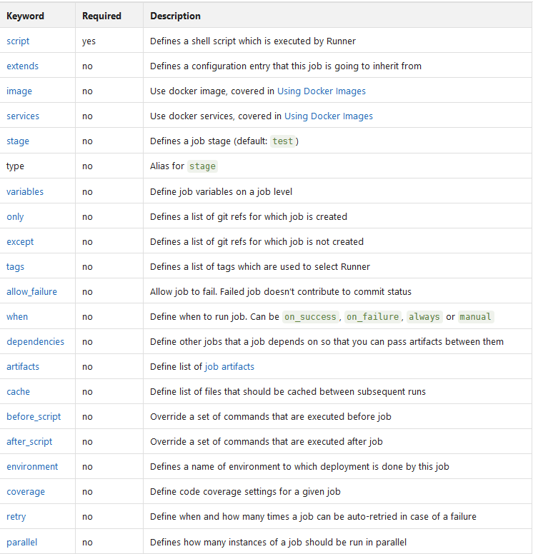
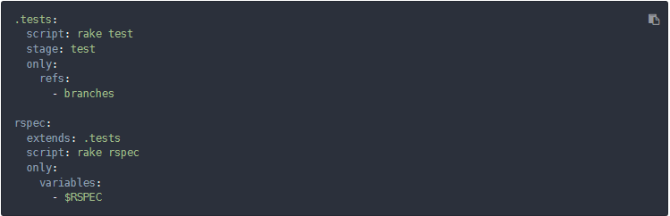
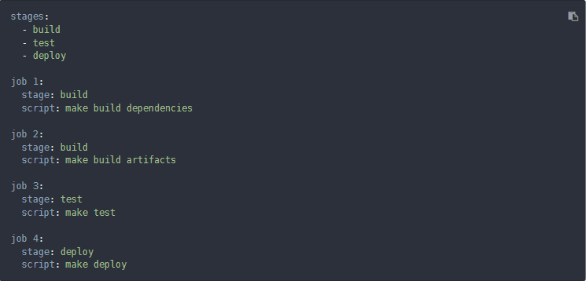
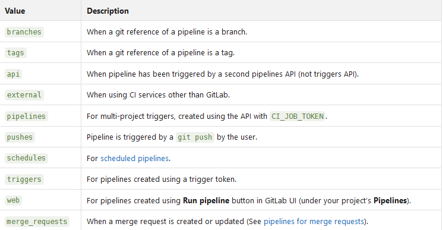

GITLAB CI/CD
======

In this documentation all keywords for a YAML file in Gitlab Ci should be listed and explained.

### Jobs
 
Defines a series of jobs with restrictions that specify when they should be executed. Specify an unlimited number of jobs that are defined as top-level elements with any name and must always contain at least the script clause.
Of course, a command can execute code directly (./configure;make;make install) or execute a script (test.sh) in the repository.
Orders are fetched from runners and executed in the runner's environment. Jobs are executed independently of each other. 
Each job must have a unique name, but there are keywords that cannot be used as job names.

### Extends

 Defines an entry name from which a job will inherit. Supports multi-level inheritance, but it is not recommended to use more than three levels. Max: 10 levels of interconnection. 
 
 

### Pages

Special task that uploads static content to Gitlab that can be used to deliver your website. It has a special syntax, so both requirements must be met:
- Every static content must be located in a public directory.
- Artifacts with a path to the directory public/ - directory must be defined.
	
In the following example, all files are simply moved from the root directory of the project to the public/ directory. The .public workaround is so that cp does not copy itself/themselves in an infinite loop.

### Images

Specify a custom Docker image and a list of these that can be used for the time of the job.

https://docs.gitlab.com/ce/ci/docker/README.html

### Before_script

command is defined to run before all jobs, including provisioning jobs, but after artifact recovery. This can be an array or a multiline string.
Before_Script and the main script are executed separately. Depending on the executor, changes may not be visible outside the work tree, e.g. software installed in before_script. 

### after_script

Defines the command to run after all jobs, including failed jobs. This must be an array or multiline string.

### Stages

Used to define levels that can be used by jobs and are globally defined.  Stage specification enables flexible multi-stage pipelines. The order of the elements in stages determines the order in which jobs are executed. 
- Jobs of the same level are executed in parallel.
- Orders of the next level are executed after the orders of the previous level have been successfully completed.

- all build requests executed in parallel 
- If build jobs are successful, the test jobs are executed in parallel. 
- If successful, all deployment jobs are executed in parallel.
- If all deployment jobs are successful, the commit is marked as passed.
- If one of the previous jobs fails, the commit is marked as failed and no jobs of the next stage are executed. 

Two side cases:
- If no phases are defined in .gitlab-ci.yml, Build, Test and Deploy can be used as the job phase by default. 
- If a job does not specify a phase, the hob is assigned the test phase.

### Stage

Stage  is defined per job and is based on levels that are defined globally. It allows the grouping of jobs in different phases and jobs of the same phases are executed in parallel.

 

### Script

script is the only keyword required for a job. It is a shell script executed by the runner.

### Only // except:

Only and except are two parameters that should be restricted to create jobs:
1. only: Defines only the names of branches and tags for which the job will be executed.
2. Except: Defines the names of branches and tags for which the job will not be executed. 

Only and except allows you to use the following keywords:

### only:refs and except:refs

The refs strategy can take the same values as the simplified / except configuration.  In the following example, the deploy-job is only created if the pipeline is planned or executed for the master industry. 

### only:kubernetes and except:kubernetes

The kubernetes strategy only accepts the active keyword. In the following example, the deployment job is only created if the kubernetes service is active in the project.

### only:variables and except:variables:

Keyword variables is used to define variable expressions. In other words, you can use predefined variables/ project/ group or environment variables to define an expression that GitLab evaluates to decide whether to create a job or not. 

### only:changes and except:changes:

Using the Change keyword with or with exceptions only, you can specify whether to create a job based on files that have been modified by a git push event.

When multiple commits in Gitlab move to an existing branch, GitLab creates and triggers the docker build job, provided that one of the commits contains the following changes:

	- Docker file
	- Files within docker/scripts directory.
	- Files and subdirectories within the Dockerfile directory.
	- Files with the extensions rb, py, sh in the directory more_scripts.

When a new industry or tag is sent to Gitlab, the policy is always evaluated as true, and Gitlab creates a job. This feature is not yet associated with merge requests. Since GitLab creates Piples, bevo a user can create a merge request, we don't know any target industry at this point yet. 
Without a target industry it is not possible to know what the common ancestor is. Therefore we always create a job in this case.  This feature is best suited for stable branches like Master, since in this case Gitlab uses the previous commit present in a branch to compare it with the latest SHA pushed

### Tags

Used to select specific runners from the list of runners that are allowed to run this project. While registering a runner you can specify the runner tags, e.g. Ruby, Postgres, development. These can be used to run jobs with runners that are assigned the specified tags.

### allow_failure

Makes a job fail without affecting the rest of the CI suite. The default value is false, except for manual jobs. If the optition is enabled and the job fails, an orange warning is displayed on the user interface. However, the logical flow of the pipeline considers the job successful and is not blocked. 
Provided that all other jobs are successful, the same orange warning is displayed at the job level and in the pipeline. However, the associated commit is marked as passed without any warnings. 

### When

 Used to implement jobs that are to be executed in error or despite the error.
Can be set to one of the following values:

	1. Execute on_success job only if all jobs from the previous stage are successful (or are considered successful because they are marked as allow_failue).
	2. execute on_failure job only if at least one job from the previous stage fails.
	3. allways: Execute job regardless of status of jobs from previous stages.
	4. manual: execute job manually (https://docs.gitlab.com/ce/ci/yaml/README.html#whenmanual)

### when:manual

Manual actions are special jobs that are not executed automatically. They must be started explicitly by a user. An example of using manual actions would be deployment in a production environment. Manual actions can be started from the Pipeline, Job, Environment, and Deployments views. These can be optional or blocking. Blocking blocks the execution of the pipeline at the stage where this action is defined. You can resume pipeline execution when someone executes a manual blocking cation by clicking a play button. If a pipeline is blocked, it is not merged if Merge on successful pipeline is set. Blocked pipelines also have a special status called manual. By default, manual actions are not blocking. If you want to block a manual action, you must add allow_faolure:false to the job definition in .gitlab-ci.yml. For optional manual actions, allow_failure:true is the default and their statuses do not contribute to the overall pipeline status. If fails as a manual action, the pipeline will eventually succeed. Manual actions are considered as write actions. Therefore, permissions for protected branches are used when the user wants to trigger an action. In other words, to trigger a manual action assigned to an industry, the user must be able to merge with that industry. 	
	
### when:delayed	
	
Delayed job is for running scripts after a certain amount of time. This is useful if you want to prevent jobs from immediately switching to pending status. You can set the period with start_in key to an elapsed time in seconds if no unit is specified. Start_in key must be less than or equal to one hour.

If there is a delayed job in a phase, the pipeline is not executed until the delayed job is completed. This means that this keyword can also be used to insert delay between different stages. The timer of a delayed job starts immediately after the previous phase is complete. Similar to other types of jobs, the timer of a delayed job does not start until the previous stage is passed. In the following example, a job called timed rollout 10% is created and executed 30 minutes after the end of the previous phase. 	

### environment 
The environment defines that a job is provided in a specific environment. If an environment is specified and no environment exists under that name, a new environment is automatically created. 

### environment:name
Environment can contain the following name: 
	- Letters
	- digits
	- spaces
	- -
	- _
	- /
	- $
	- {
	- }
Common names are qa, staging, production. Instead of defining the name of the environment directly after the environment keyword, you can also define it as a separate value.

### environment:url

Parameter url can use all defined CI variables, including predefined secure variables and .gitlab-ci.yml variables. However, you cannot use variables defined in Script. This is an optional value that, when set, makes buttons available at different locations in Gitlab. Clicking on it takes you to the defined URL.

### environment: on_stop

If the environment is defined by a stop action, Gitlab automatically triggers a stop action when the associated industry is deleted. Closing (stopping) environments can be achieved with the on_stop keyword defined under Environment. It declares another job running to close the environment. 

### environment:action

Used in conjunction with on_stop and defined in the job called to close the environment.

### Cache

This specifies a list of files and directories to be cached between jobs. You can only use paths that are in the project workspace. If the cache is defined outside the job size, this means that it is global and all jobs use these definitions. 

### cache:paths: 
Use the path directive to select which files or directories to cache. Wildcards can also be used. Cache all files in binary files ending in .apk and the .config file:

### cache:key

The key directive allows you to define the affinity of caching between jobs. So you have a single cache for all jobs, cache per job, cache per branch or any other way that fits your workflow. This way you can optimize caching and cache data between different jobs or even different branches.

### cache:untracked
Set untracked: true to cache all files that are not stored in your git repository.

### cache:policy

The default behavior of a cache job is to download the files at the beginning of execution and upload them again at the end. This allows all changes made by the job to be retained for future runs. This is called a pull-push cache policy.
If you know that the job does not change the cached files, you can skip the upload step by setting the policy: Subtract the job specification. Normally, this is connected to an ordinary cache job at an earlier time to ensure that the cache is updated from time to time.

### Artifacts

artifacts is used to specify a list of files and directories to attach to the job after successful completion. The artifacts are sent to GitLab after successful completion of the job and are available for download in the GitLab user interface.

### artifacts:paths

Sie können nur Pfade verwenden, die sich im Projektarbeitsbereich befinden. Informationen zum Übergeben von Artefakten zwischen verschiedenen Jobs finden Sie unter Abhängigkeiten.

Senden Sie alle Dateien in Binärdateien und .config.

### artifacts:name

The name directive allows you to define the name of the created artifact archive. In this way you can give each archive a unique name, which can be useful if you want to download the archive from GitLab. The variable artifacts: name can use any of the predefined variables. The default name is Artifacts, which becomes artifacts when downloaded.

### artifacts:untracked

Artifacts: untracked is used to add all unrecorded git files as artifacts (along the paths defined in Artifacts: path).

### artifacts:when

Artifacts:when Used to upload artifacts on a job error or despite the error.
Artifacts:when When can be set to one of the following values:
	1. on_success - Only upload artifacts if the job was successfully completed. This is the default setting.
	2. on_failure - Upload artifacts only if the job fails.
always - Upload artifacts regardless of job status.

### artifacts:expire_in

With expire_in you can specify how long you want artifacts to live before they expire and are therefore deleted. This applies from the moment they are uploaded and stored in GitLab. If the expiration time is not defined, the setting for the entire instance is used by default (by default 30 days, forever at GitLab.com).
You can use the "Keep" button on the job page to overwrite the process and keep artifacts forever.
After their expiration, artifacts are deleted by default hourly (via a cron job) and are no longer accessible.
The value of expire_in is an elapsed time in seconds if no unit is specified. 

### artifacts:reports

The keyword reports collects test reports of jobs and displays them in the GitLab user interface (merge requests, pipeline views). Read how to use this with JUnit reports.

### artifacts:reports:junit

The Junit report captures JUnit XML files as artifacts. Although JUnit was originally developed in Java, there are many third-party ports for other languages such as JavaScript, Python, Ruby, and so on.
For more information and examples, see JUnit test reports. The following is an example of capturing a JUnit XML file using Ruby's RSpec test tool:

### Dependencies

This function should be used in conjunction with artifacts and allows you to define the artifacts to be transferred between different jobs. Note that artifacts from all previous levels are transferred by default. To use this function, define dependencies in the context of the job and pass a list of all previous jobs from which the artifacts are to be downloaded. You can only define jobs of levels that are executed before the current ones. An error is displayed when you define jobs from the current or next stage. If you define an empty array, no artifacts will be downloaded for this job. The status of the previous job is not taken into account when dependencies are used. If it fails or it is a manual job that was not executed, no error occurs.

### Coverage

Mit der Coverage können Sie konfigurieren, wie die Codeabdeckung aus der Jobausgabe extrahiert wird.

Reguläre Ausdrücke sind der einzig gültige Wert, der hier erwartet wird. Daher ist die Verwendung von umgebend / obligatorisch, um eine reguläre Ausdruckszeichenfolge konsistent und explizit darzustellen. Sie müssen Sonderzeichen mit Escapezeichen versehen, wenn Sie sie buchstäblich abgleichen möchten.

### Retry

You can use retry to configure how often a job is tried again if an error occurs. If a job fails and the repetition has been configured, it is processed again up to the number specified in the repetition keyword. If Repeat is set to 2 and a job succeeds in a second pass (first attempt), it will not be repeated. The repetition value must be a positive integer equal to or greater than 0, but less than or equal to 2 (a maximum of two repetitions, a total of three passes).

### Parallel

Parallel allows you to configure how many instances of a job are to be executed in parallel. This value must be greater than or equal to two (2) and less than or equal to 50. This creates N instances of the same job that are executed in parallel. They are named sequentially from job name 1 / N to job name N / N.

### Include 

The keyword include allows you to include external YAML files.
In the following example, the content of .before-script-template.yml together with the content of .gitlab-ci.yml is automatically retrieved and evaluated:

### Variables

With GitLab CI / CD you can define variables in .gitlab-ci.yml, which are then passed in the job environment. They can be defined globally and per job. If the keyword variables is used at job level, the global and predefined YAML variables are overwritten.

These variables can later be used in all executed commands and scripts. The variables defined by YAML are also fixed to all service containers created so that they can be fine-tuned.
Apart from the user-defined variables, there are also those set up by the runner himself. An example would be CI_COMMIT_REF_NAME, which contains the value of the branch or variable name for which the project is created. Besides the variables that you can set in .gitlab-ci.yml, there are also the so-called variables that can be set in the GitLab user interface.

### Git strategy

You can specify GIT_STRATEGY, which is used to retrieve current application code, either globally or per job in the variable section. If you do not specify a value, the default value from the project settings is used.
There are three possible values: clone, retrieve, and none.

Clone is the slowest option. It clones the repository for each job from scratch to ensure that the project workspace is always flawless.
Fetch is faster because the project workspace is reused (when cloning is used if it does not exist). git clean undoes all changes made by the last job. git fetch gets commits that have been executed since the last job.
None reuses the project workspace, but skips all git operations (including the GitLab Runner pre-Clone script, if any). This is especially useful for jobs that only work with artifacts (e.g. implement). Git repository data is available, but certainly not up to date. Therefore, you should only rely on files that are loaded from the workspace cache or artifacts into the project workspace.

### Git submodule strategy:

The GIT_SUBMODULE_STRATEGY variable is used to control whether / how git submodules are included when retrieving the code before a build. You can set them globally or per job in the variable area.

### Git checkout 

The GIT_CHECKOUT variable can be used when GIT_STRATEGY is set to either clone or retrieve to indicate whether a git checkout should be performed. If not specified, the default value is true. You can set them globally or per job in the variable area.
