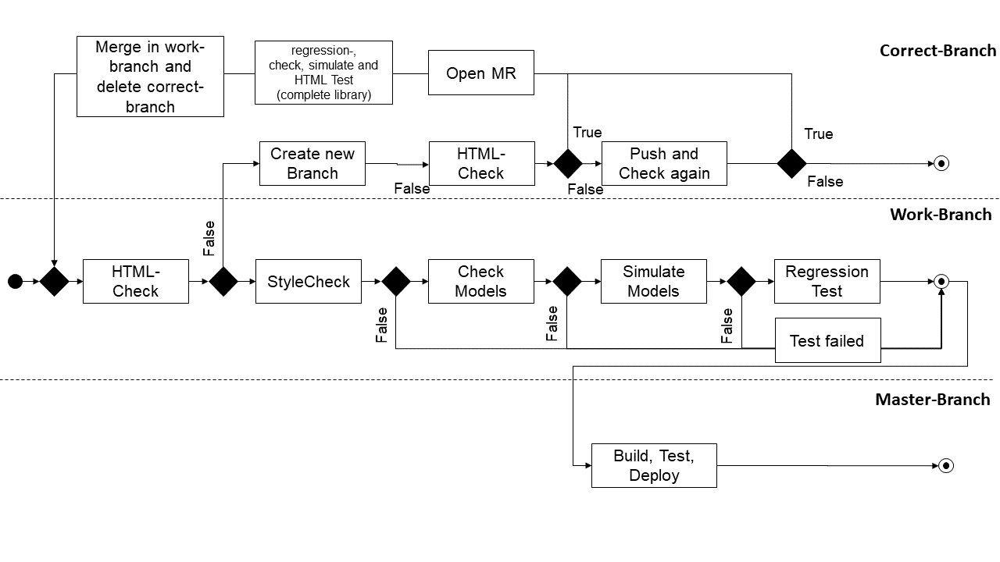
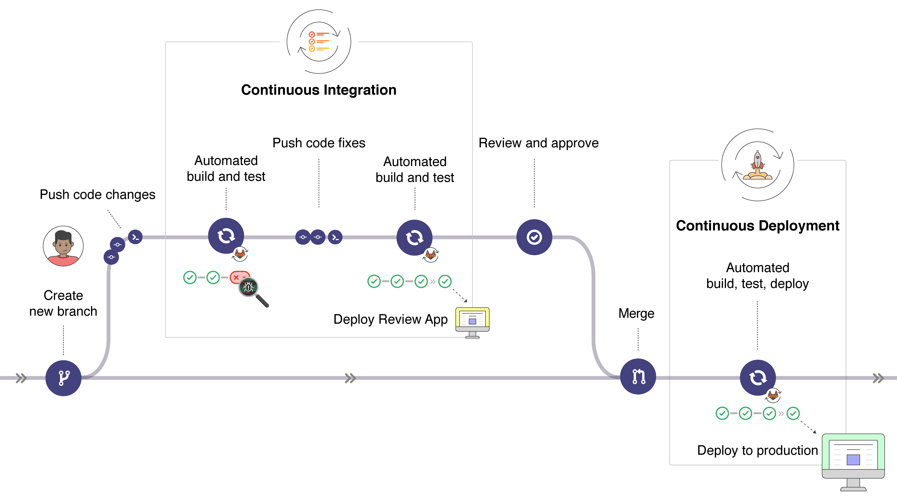
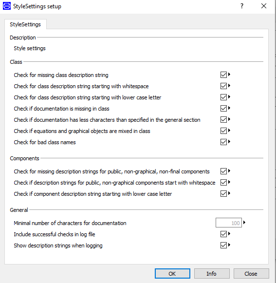
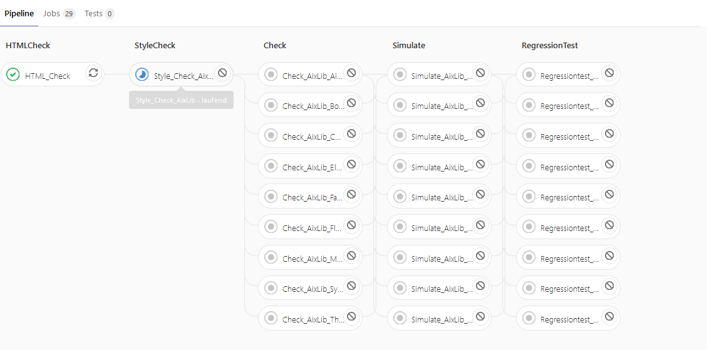

# Here you find the Documentation for the CI Test for AixLib
## What is it?
At this time are five different Checks implemented. 

## What is implement?

## [_config.py](_config.py)
The files `_config.py` contains file references and set variables which are important for the tests as well as the creation of CI templates. 

Before the templates are created with the command 

`python bin/CITests/07_ci_templates/ci_templates.py`, 

the variables `image_name` and `variable_main_list` in the file `_config.py` should be checked to see if they are set correctly for the current repository. 

## [01_CleanUp](01_CleanUp)
 
### cleanmodelica

This script deletes following files:

	'buildlog.txt', 'dsfinal.txt', 'dsin.txt', 'dslog.txt', 
	'dsmodel*', 'dymosim', 'dymosim.lib', 'dymosim.exp', 
	'dymosim.dll', 'dymola.log', 'dymosim.exe', '*.mat', '*.mof', 
	'*.bak-mo', 'request.', 'status.', 'status', 'failure', 
	'success.','stop', 'stop.','fmiModelIdentifier.h', 'modelDescription.xml',
	'fmiFunctions.o', 'CSVWriter.csvWriter.csv', 'test.csv',

### setting_check

Checks if all necessary variables and files are set or exist.

The test is performed by the commit `git commit -m "ci_setting"`.

Then the templates are created based on the CI_setting.toml file and pushed into the current branch.

## [02_UnitTests](02_UnitTests)
Scripts that simulate and validate modelica models using dymola	

### reference_check.py
The regression test is implemented with the following command:	
`cd AixLib && python ../bin/CITests/02_UnitTests/reference_check.py -n 2 --tool dymola --single-package "AixLib.Airflow" --library AixLib --batch -DS 2020`

Further information can be found under the following [link](../Documentation/How_to_integrate_new_tests.md) and explains among other things how to create new UnitTests.

### validatetest.py
This test checks the models and simulates the packages "examples" and "validations". 

The following command is used to check the models except models that are on the whitelist  :

`python bin/CITests/02_UnitTests/CheckPackages/validatetest.py  --single-package "Airflow" --library AixLib -DS 2020 --wh-library IBPSA --filterwhitelist`

The following command is used to check the models without a whitelist:

`python bin/CITests/02_UnitTests/CheckPackages/validatetest.py  --single-package Airflow --library AixLib -DS 2020`

The following command is used to simulate the examples except models that are on the whitelist  :

`python bin/CITests/02_UnitTests/CheckPackages/validatetest.py  --single-package Airflow --library AixLib -DS 2020 --wh-library IBPSA --filterwhitelist --simulateexamples`

The following command is used to simulate the examples without a whitelist:

`python bin/CITests/02_UnitTests/CheckPackages/validatetest.py  --single-package Airflow --library AixLib -DS 2020   --simulateexamples`

## [03_SyntaxTests](03_SyntaxTests)
This folder evaluated and correct the code in the AixLib. 

### html_tidy_errors.py
At this point the HTML code in the Aixlib modelica Models is corrected.
Additionally the code is corrected  the HTML Code to the HTML5 syntax. This include following Warning and Errors: 

	Warning: 
 attribute "align" not allowed for HTML5
	Warning:  element removed from HTML5
	Warning: <th> attribute "align" not allowed for HTML5
	Warning: The summary attribute on the <table> element is obsolete in HTML5
   
If the test was not successfull, CI creates a new branch and push the corrected code to the new branch. 
For this process you have to create new variables in your repository.

For the implementation of the html_tidy errors.py the following step must be done.

#### $GL_TOKEN
1. Log in to GitLab.
2. In the upper-right corner, click your avatar and select Settings.
3. On the User Settings menu, select Access Tokens.
4. Choose a name and optional expiry date for the token.
5. Choose the desired scopes.
6. Click the Create personal access token button.
7. Save the personal access token somewhere safe. Once you leave or refresh the page, you won’t be able to access it again

[Create a GL_TOKEN](https://docs.gitlab.com/ce/user/profile/personal_access_tokens.html#creating-a-personal-access-token)

### StyleChecking.py

This Script evaluated the documentation of the AixLib Models in dymola. The script operated with the ModelManagement in Dymola. 

To work with this Script type following Command:

`python bin/CITests/03_SyntaxTests/StyleChecking.py -s AixLib -p AixLib/package.mo -DS 2020`

At this time the models are not up to date to pass the tests StyleCheck successfully. Therefore the tests are only applied to new models in the short term to ensure that the styles are correct and correspond to the settings.
In the future, the models that fail the test will have to be revised and adapted.
If the Test failed, Gitlab export two log files with a errorlist.

### IBPSA [Merge](06_deploy/IBPSA_Merge)
As soon as the branch IBPSA_Merge is created the automatic merging of the IBPSA repo starts. First the models of the IBPSA are copied into the AixLib and then a suitable conversion skirpt. In the next stage the white lists are updated. Finally a pull request is created. The user should now check the AixLib again locally. At the same time, the CI runs and checks and simulates models, as well as performs a regression test. If certain models or scripts need to be adjusted manually, the user should do so with the comment message "fix errors manually".

## Overall process

The entire CI test looks as follows.

# What is done?

- Simulate Modeles
- Check Models
- Regression test of models
- HTML Check and Correction
- Check the style of modelica models

