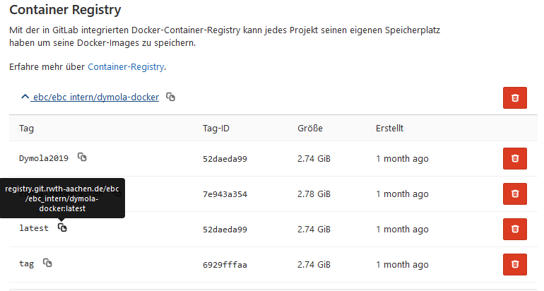
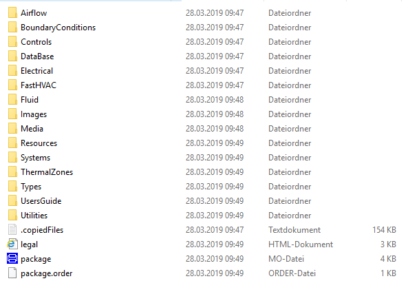

How to integrate new tests ?
======

The YAML file (.gitlab-ci.yml) is used to control the 
integrated CI in Gitlab and refers to certain tests that 
are to be performed. 
The tests can be performed in several stages to prove 
which tests have been successfully performed or failed.

The following is a simple example of a YAML file: 

```yml
stages: 
- analysis
test_dymola_thermalzones:
image: registry.git.rwth-aachen.de/ebc/ebc_intern/dymola-docker:latest
	stage: analysis
	services:
	  -  docker
	
	before_script:
	  - sudo apt-get update
	  - sudo apt-get install xvfb xfonts-100dpi xfonts-75dpi xfonts-cyrillic xorg dbus-x11 -y
	  - Xvfb :77 -extension RANDR -extension GLX & export DISPLAY=:77.0 &&
	  - sudo python -m pip install setuptools
	  - sudo python -m pip install pathlib
	
	
	script:
	  - cd script/Python
	  - python Test.py
artifacts:
	 paths:
	  - Reference
```

In this example only one stage "analysis" 
with a job "test_dymola_thermalzones" is given. 
Under image the Docker Image is specified, 
with which the container is later created and in 
which the scripts and tests are executed. 
Here the integrated Docker Registry of Gitlab is 
referenced:



The stage to be processed and the service docker 
are then specified. 
Before the scripts in the repository are 
executed, additional installations such as Python 
libraries can be done under before_script as 
well as the command 
 ` Xvfb :77 -extension RANDR -extension GLX & export DISPLAY=:77.0 &&  `
because otherwise Dymola will not be started correctly and it can lead to an error. 

Under script, a reference to the script to be run is now executed and then these are run. If the script ran correctly, the job was executed successfully.

So the most important keywords for a YAML file are here:

```
	- Image
	- services
	- stages
	- types
	- Before_script
	- After_script
	- variables 
	- cache
```

In addition to the keywords, there are also configurations that can be used in the 
are described in more detail in the documentation Gitlab CI/CD commands.

In the following the current YAML file for the Aixlib is shown. 
Here several packages of the Aixlib are tested with a UnitTest, i.e. the models are compared with reference data to avoid possible unwanted changes.




In this test the packages "Airflow", "FastHVAC", "Fluid", "Media", "Systems", "ThermalZones", "Electrical" and "BoundaryConditions" are tested in their own stages.
The tests are used using the buildingspy of the "Berkeley Lab" in the Python language and uses the Python interface for Modelica. This means that tests can be controlled and executed via Python in Dymola. The different jobs differ only in the different packages.    


```yml
    test_dymola_Airflow:
      image: registry.git.rwth-aachen.de/ebc/ebc_intern/dymola-docker:conda-integration
      stage: test
      services:
        -  docker
      # variables:
      #   CI_DEBUG_TRACE: "true"
    
      before_script:
        - Xvfb :77 -extension RANDR -extension GLX & export DISPLAY=:77.0 &&
        - export PIP_CACHE_DIR="/opt/cache/pip"
        - source activate python27
        - python -V               # Print out python version for debugging
        - dir
        - export PYTHONIOENCODING=utf-8 # just in case
    
      script:
        - cd AixLib && python ../bin/runUnitTests.py -n 2 --batch --single-package AixLib.Airflow --tool dymola
    
      artifacts:
        when: on_failure
        paths:
          - AixLib/simulator-dymola.log
    
      retry:
        max: 2
        when: runner_system_failure
    
    
    test_dymola_BoundaryConditions:
      image: registry.git.rwth-aachen.de/ebc/ebc_intern/dymola-docker:conda-integration
      stage: test
      services:
        -  docker
      # variables:
      #   CI_DEBUG_TRACE: "true"
    
      before_script:
        - Xvfb :77 -extension RANDR -extension GLX & export DISPLAY=:77.0 &&
        - export PIP_CACHE_DIR="/opt/cache/pip"
        - source activate python27
        - python -V               # Print out python version for debugging
        - dir
        - export PYTHONIOENCODING=UTF8 # just in case
    
      script:
        - cd AixLib && python ../bin/runUnitTests.py -n 2 --batch --single-package AixLib.BoundaryConditions --tool dymola
    
      artifacts:
        when: on_failure
        paths:
          - AixLib/simulator-dymola.log
    
      retry:
        max: 2
        when: runner_system_failure
    
    
    test_dymola_Controls:
      image: registry.git.rwth-aachen.de/ebc/ebc_intern/dymola-docker:conda-integration
      stage: test
      services:
        -  docker
      # variables:
      #   CI_DEBUG_TRACE: "true"
    
      before_script:
        - Xvfb :77 -extension RANDR -extension GLX & export DISPLAY=:77.0 &&
        - export PIP_CACHE_DIR="/opt/cache/pip"
        - source activate python27
        - python -V               # Print out python version for debugging
        - dir
        - export PYTHONIOENCODING=UTF8 # just in case
    
      script:
        - cd AixLib && python ../bin/runUnitTests.py -n 2 --batch --single-package AixLib.Controls --tool dymola
    
      artifacts:
        when: on_failure
        paths:
          - AixLib/simulator-dymola.log
    
      retry:
        max: 2
        when: runner_system_failure
    
    
    test_dymola_Electrical:
      image: registry.git.rwth-aachen.de/ebc/ebc_intern/dymola-docker:conda-integration
      stage: test
      services:
        -  docker
      # variables:
      #   CI_DEBUG_TRACE: "true"
    
      before_script:
        - Xvfb :77 -extension RANDR -extension GLX & export DISPLAY=:77.0 &&
        - export PIP_CACHE_DIR="/opt/cache/pip"
        - source activate python27
        - python -V               # Print out python version for debugging
        - dir
        - export PYTHONIOENCODING=UTF8 # just in case
    
      script:
        - cd AixLib && python ../bin/runUnitTests.py -n 2 --batch --single-package AixLib.Electrical --tool dymola
    
      artifacts:
        when: on_failure
        paths:
          - AixLib/simulator-dymola.log
    
      retry:
        max: 2
        when: runner_system_failure
    
    
    test_dymola_FastHVAC:
      image: registry.git.rwth-aachen.de/ebc/ebc_intern/dymola-docker:conda-integration
      stage: test
      services:
        -  docker
      # variables:
      #   CI_DEBUG_TRACE: "true"
    
      before_script:
        - Xvfb :77 -extension RANDR -extension GLX & export DISPLAY=:77.0 &&
        - export PIP_CACHE_DIR="/opt/cache/pip"
        - source activate python27
        - python -V               # Print out python version for debugging
        - dir
        - export PYTHONIOENCODING=UTF8 # just in case
    
      script:
        - cd AixLib && python ../bin/runUnitTests.py -n 2 --batch --single-package AixLib.FastHVAC --tool dymola
    
      artifacts:
        when: on_failure
        paths:
          - AixLib/simulator-dymola.log
    
      retry:
        max: 2
        when: runner_system_failure
    
    
    test_dymola_Fluid:
      image: registry.git.rwth-aachen.de/ebc/ebc_intern/dymola-docker:conda-integration
      stage: test
      services:
        -  docker
      # variables:
      #   CI_DEBUG_TRACE: "true"
    
      before_script:
        - Xvfb :77 -extension RANDR -extension GLX & export DISPLAY=:77.0 &&
        - export PIP_CACHE_DIR="/opt/cache/pip"
        - source activate python27
        - python -V               # Print out python version for debugging
        - dir
        - export PYTHONIOENCODING=UTF8 # just in case
    
      script:
        - cd AixLib && python ../bin/runUnitTests.py -n 2 --batch --single-package AixLib.Fluid --tool dymola
    
      artifacts:
        when: on_failure
        paths:
          - AixLib/simulator-dymola.log
    
      retry:
        max: 2
        when: runner_system_failure
    
    
    test_dymola_Media:
      image: registry.git.rwth-aachen.de/ebc/ebc_intern/dymola-docker:conda-integration
      stage: test
      services:
        -  docker
      # variables:
      #   CI_DEBUG_TRACE: "true"
    
      before_script:
        - Xvfb :77 -extension RANDR -extension GLX & export DISPLAY=:77.0 &&
        - export PIP_CACHE_DIR="/opt/cache/pip"
        - source activate python27
        - python -V               # Print out python version for debugging
        - dir
        - export PYTHONIOENCODING=UTF8 # just in case
    
      script:
        - cd AixLib && python ../bin/runUnitTests.py -n 2 --batch --single-package AixLib.Media --tool dymola
    
      artifacts:
        when: on_failure
        paths:
          - AixLib/simulator-dymola.log
    
      retry:
        max: 2
        when: runner_system_failure
    
    
    test_dymola_Systems:
      image: registry.git.rwth-aachen.de/ebc/ebc_intern/dymola-docker:conda-integration
      stage: test
      services:
        -  docker
      # variables:
      #   CI_DEBUG_TRACE: "true"
    
      before_script:
        - Xvfb :77 -extension RANDR -extension GLX & export DISPLAY=:77.0 &&
        - export PIP_CACHE_DIR="/opt/cache/pip"
        - source activate python27
        - python -V               # Print out python version for debugging
        - dir
        - export PYTHONIOENCODING=UTF8 # just in case
    
      script:
        - cd AixLib && python ../bin/runUnitTests.py -n 2 --batch --single-package AixLib.Systems --tool dymola
    
      artifacts:
        when: on_failure
        paths:
          - AixLib/simulator-dymola.log
    
      retry:
        max: 2
        when: runner_system_failure
    
    
    test_dymola_ThermalZones:
      image: registry.git.rwth-aachen.de/ebc/ebc_intern/dymola-docker:conda-integration
      stage: test
      services:
        -  docker
      before_script:
        - Xvfb :77 -extension RANDR -extension GLX & export DISPLAY=:77.0 &&
        - export PIP_CACHE_DIR="/opt/cache/pip"
        - source activate python27
        - python -V               # Print out python version for debugging
        - dir
        - export PYTHONIOENCODING=UTF8 # just in case
    
      script:
        - cd AixLib && python ../bin/runUnitTests.py -n 2 --batch --single-package AixLib.ThermalZones --tool dymola
    
      artifacts:
        when: on_failure
        paths:
          - AixLib/simulator-dymola.log
    
      retry:
        max: 2
        when: runner_system_failure
```


The other Aixlib packages must also be checked for future tests. 
For this purpose, current reference data for the respective models or packages must be
created and stored in order to compare them later. 
For this purpose .mos scripts are used in Dymola. 
This means that a .mos script must be created for each individual model with 
the respective variables to be examined. 
The following is an example for the model "AixLib.Airflow.AirHandlingUnit.Examples.AHU".


	simulateModel("AixLib.Airflow.AirHandlingUnit.Examples.AHU", stopTime=86400, outputInterval=60, method="lsodar", tolerance=1e-6, resultFile="AHU");

	createPlot(
	  id=1, 
	  position={917, 10, 693, 691}, 
	  y={"ahu.allCond"}, 
	  range={0.0, 90000.0, 0.89, 1.11}, 
	  grid=true, 
	  filename="TestAHU.mat", 
	  colors={{28,108,200}}, 
	  markers={MarkerStyle.SmallSquare});

	createPlot(
	  id=2, 
	  position={60, 18, 727, 669}, 
	  y={"ahu.startState.active", "ahu.deHuHRS_true.active", "ahu.deHuHRS_false.active", "ahu.onlyHeatingHRS_true.active", "ahu.onlyHeatingHRS_false.active"}, 
	  range={0.0, 90000.0, -0.05, 1.05}, 
	  grid=true, 
	  filename="TestAHU.mat", 
	  colors={{28,108,200}, {238,46,47}, {0,140,72}, {217,67,180}, {0,0,0}}, 
	  markers={MarkerStyle.SmallSquare, MarkerStyle.SmallSquare, MarkerStyle.SmallSquare, MarkerStyle.SmallSquare, MarkerStyle.SmallSquare});

	createPlot(
	  id=3, 
	  position={821, 15, 744, 666}, 
	  y={"ahu.onlyCoolingHRS_true.active", "ahu.onlyCoolingHRS_false.active", "ahu.huPreHHRS_true.active", "ahu.huPreHHRS_false.active", "ahu.huCHRS_true.active", "ahu.huCHRS_false.active"}, 
	  range={0.0, 90000.0, -0.05, 1.05}, 
	  grid=true, 
	  filename="TestAHU.mat", 
	  colors={{28,108,200}, {238,46,47}, {0,140,72}, {217,67,180}, {0,0,0}, {162,29,33}}, 
	  markers={MarkerStyle.SmallSquare, MarkerStyle.SmallSquare, MarkerStyle.SmallSquare, MarkerStyle.SmallSquare, MarkerStyle.SmallSquare, MarkerStyle.SmallSquare});

	createPlot(
	  id=4, 
	  position={77, 62, 1429, 635}, 
	  y={"ahu.QflowC", "ahu.QflowH"}, 
	  range={0.0, 88000.0, -100000.0, 2100000.0}, 
	  grid=true, 
	  filename="TestAHU.mat", 
	  colors={{28,108,200}, {238,46,47}});

	createPlot(
	  id=5, 
	  position={50, 59, 1411, 632}, 
	  y={"ahu.X_oda", "ahu.X_supMin", "ahu.X_supMax"}, 
	  range={0.0, 88000.0, 0.0058000000000000005, 0.0102}, 
	  grid=true, 
	  filename="TestAHU.mat", 
	  colors={{28,108,200}, {238,46,47}, {0,140,72}}, 
	  markers={MarkerStyle.SmallSquare, MarkerStyle.SmallSquare, MarkerStyle.SmallSquare});

	createPlot(
	  id=6, 
	  position={31, 19, 1416, 654}, 
	  y={"ahu.T_6", "ahu.T_oda", "ahu.T_supplyAirOut"}, 
	  range={0.0, 88000.0, 8.0, 30.0}, 
	  grid=true, 
	  filename="TestAHU.mat", 
	  colors={{28,108,200}, {238,46,47}, {28,108,200}}, 
	markers={MarkerStyle.SmallSquare, MarkerStyle.SmallSquare, MarkerStyle.None});


The mos. scripts for the models can be found under Aixlib/Resources/Scripts/Dymola/... .
The generated reference files, with which the simulation results are later compared, are located under the path Aixlib/Resources/ReferenceResults/Dymola in the form of a text file (.txt). 
Basically, the runUnitTests.py script compares all variables plotted by a *.mos script with the reference results. If the results have changed by more than 1E-3 absolute or relative errors, a warning is written to the console and a plot with the reference results and the new results is displayed to the user. The results are then played back in a log file. 

To enable an automatic component test, certain conditions must be met. 

1. provide a package in the example of a Modelica model
2. make a Modelica script available in Aixlib/Resources/Scripts/Dymola/.../Examples. The script must execute the model and display the results.
3. undertake to cite the new reference results generated in Aixlib/Resources/ReferenceResults/Dymola when performing the component tests. 

Each model must also meet the following requirements:

- The experiment annotation must be present for the JModelica and OpenModelica unit tests.
- The Tolerance annotation must be present for the JModelica unit tests.
- The Tolerance must be smaller than 1e-6 for the JModelica unit tests.
- The StopTime annotation must be present to add the model to the unit tests of OpenModelica.
- The StartTime, and StopTime of the experiment annotation are not allowed to use multiplication (e.g. StartTime=6*86400), only literal values are allowed. This is required by JModelica and OpenModelica
- The Tolerance, StartTime, and StopTime defined in the Modelica model must match the tolerance, startTime, and stopTime defined in the corresponding Modelica script.
- The __Dymola_Commands annotation will add an item to Dymola's pull-down menu. The Modelica script needs to contain a plot command that plots model results. Only plotted results will be included in when comparing the new results with reference results. For example, the script to run the unit test for the model Damper is as follows:

Here is an example
	
	within AixLib.Airflow.AirHandlingUnit.Examples;
	model AHU
	
	...
	...
	...
	
	annotation (Diagram(coordinateSystem(preserveAspectRatio=false, extent={{-100,
				-100},{100,100}}), graphics={
			Text(
			  extent={{-60,80},{-22,54}},
			  lineColor={28,108,200},
			  fontSize=6,
			  textString="Heat        Cool        Dehu        Hu        HRS
	1        1        1        1        1
	1        1        1        0        1
	1        1        0        1        1
	1        1        0        0        1
	1        0        0        0        1
	0        1        0        0        1
	0        0        0        0        1
	1        1        1        1        0
	1        1        1        0        0
	1        1        0        1        0
	1        1        0        0        0
	1        0        0        0        0
	0        1        0        0        0
	0        0        0        0        0
	"),     Text(
			  extent={{-60,96},{-16,86}},
			  lineColor={28,108,200},
			  textString="Use the following Table for investigation of all possible modes.
	Check whether variable allCond is always 1.")}),
		experiment(
		  StopTime=86400,
		  Interval=60,
		  Tolerance=1e-06),
		__Dymola_Commands(file="modelica://AixLib/Resources/Scripts/Dymola/Airflow/AirHandlingUnit/Examples/AHU.mos"
			"Simulate and plot")
			


For further information on how to use theUnitTest, please refer to the following link
https://github.com/ibpsa/modelica-ibpsa/wiki/Unit-Tests

