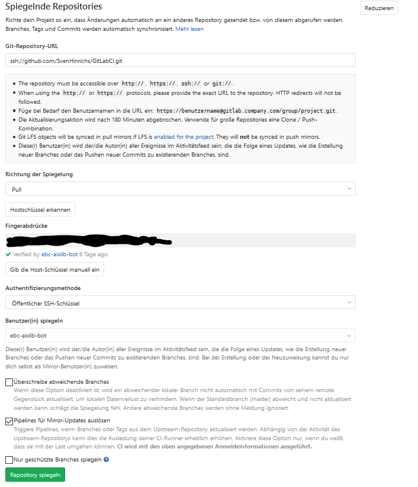
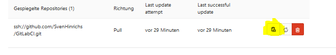
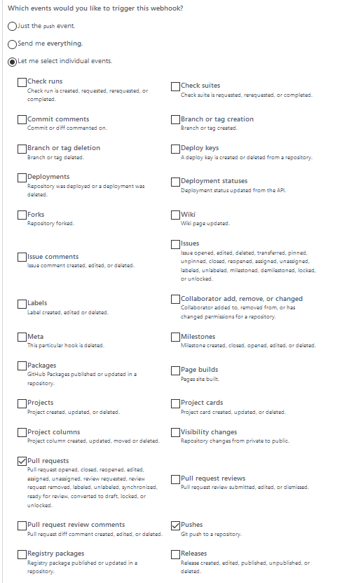

# Here you find the Documentation für CI Tests with AixLib
## What is CI?

Continuous integration is a term from software development that describes the process of continuously assembling components to form an application. 
The goal of continuous integration is to increase software quality.
Typical actions are translating and linking the application parts, but in principle any other operations to generate derived information are performed. 
Usually, not only the entire system is rebuilt, but also automated tests are performed and software metrics are created to measure software quality. 
The whole process is automatically triggered by checking into the version control system.

### How we use CI?
In our case we mirror a github repository in GitLab. This way the repository can be tested and corrected with the CI in Gitlab. 
We also use the Docker service to create an image containing Dymola and thus be able to simulate models in Dymola.

For more information read the [General Documentation](https://git.rwth-aachen.de/sven.hinrichs/GitLabCI/blob/master/bin/04_Documentation/Documentation_GitLab.md) and the Repository [Dymola-Docker](https://git.rwth-aachen.de/EBC/EBC_intern/dymola-docker)

## What CI Tests are implement?
#### Check, Simulate and Regressiontest: [UnitTests](https://git.rwth-aachen.de/sven.hinrichs/GitLabCI/tree/master/bin/02_CITests/UnitTests)

With these tests, models are validated or simulated or models will  compared and evaluated with stored values by means of a unit test.

#### Correct HTML and Style Check: [SyntaxTest](https://git.rwth-aachen.de/sven.hinrichs/GitLabCI/tree/master/bin/02_CITests/SyntaxTests)

The html code (documentation) is tested and corrected if necessary. Thus the deposited HTML code is checked for correctness and correct

With the ModelManagement library in dymola the style of the models is checked. 

#### Clean the Modelica [CleanUpSkripts](https://git.rwth-aachen.de/sven.hinrichs/GitLabCI/tree/master/bin/02_CITests/CleanUpSkripts)
Removes any files that were created when running simulations in Dymola, such as *.mat or dymola.log 

## Folder 
The folder contains the subfolder 01_BaseFunction, 02_CITests, 03_Whitelists, 04_Documentation, 05_Templates and 06_Configfiles. 

### 1 BaseFunction
This folder contains tests and functions that are builded for the CI Tests. 

### 2 CITests
This folder contains all CI tests for AixLib in GitLab with unitTests, syntaxTest and cleanUpScripts
For more information view this [CI Tests](https://git.rwth-aachen.de/sven.hinrichs/GitLabCI/tree/master/bin/02_CITests).

### 3 WhiteLists
This folder contains models in [WhiteLists](https://git.rwth-aachen.de/sven.hinrichs/GitLabCI/tree/master/bin/03_WhiteLists), which will not test in the CITests.

### 4 Documentation
This folder contains [documentation](https://git.rwth-aachen.de/sven.hinrichs/GitLabCI/tree/master/bin/04_Documentation) for CI, e.g. how new tests can be integrated or relevant commands for the CI 

### 5 Templates
This folder contains [Templates](https://git.rwth-aachen.de/sven.hinrichs/GitLabCI/tree/master/bin/05_Templates) for the CI tests implemented so far. The following example can be used to implement the tests in the CI. 

	#!/bin/bash
	image: registry.git.rwth-aachen.de/ebc/ebc_intern/dymola-docker:miniconda-latest

	stages:
		- deleteBranch
		- SetSettings
		- CheckSettings
		- build
		- HTMLCheck
		- deploy
		- openMR
		- post
		- StyleCheck
		- Check
		- Simulate
		- RegressionTest
	 
	variables:
		Praefix_Branch: "Correct_HTML_"
		TARGET_BRANCH: $CI_COMMIT_REF_NAME
		Newbranch: ${Praefix_Branch}${CI_COMMIT_REF_NAME}
		StyleModel: AixLib.Airflow.Multizone.DoorDiscretizedOpen
		Github_Repository : SvenHinrichs/GitLabCI
	
	

	include:
		- project: 'EBC/EBC_all/gitlab_ci/templates'
		- file: 'ci-tests/CheckConfiguration/check_settings.gitlab-ci.yml'
		- project: 'EBC/EBC_all/gitlab_ci/templates'
		- file: 'ci-tests/SyntaxTests/html_check.gitlab-ci.yml'
		- project: 'EBC/EBC_all/gitlab_ci/templates'
		- file: 'ci-tests/SyntaxTests/style_check.gitlab-ci.yml'
		- project: 'EBC/EBC_all/gitlab_ci/templates'
		- file: 'ci-tests/UnitTests/check_model.gitlab-ci.yml'
		- project: 'EBC/EBC_all/gitlab_ci/templates'
		- file: 'ci-tests/UnitTests/regression_test.gitlac-ci.yml'
		- project: 'EBC/EBC_all/gitlab_ci/templates'
		- file: 'ci-tests/UnitTests/simulate_model.gitlab-ci.yml'	
		

The templates are also implemented under the following repository [Templates](https://git.rwth-aachen.de/EBC/EBC_all/gitlab_ci/templates)

### 6 Configfiles

This folder contains [Config files](https://git.rwth-aachen.de/sven.hinrichs/GitLabCI/tree/master/bin/06_Configfiles) which are used for the CI. 

For question ask [Sven Hinrichs](https://git.rwth-aachen.de/sven.hinrichs)

# How Configure the CI Tests

## Configure Variables

### Github_Repository : 
This variable consists of owner/repo (e.g. RWTH-EBC/AixLib) and is used for code that was changed by the CI. (git@github.com:RWTH-EBC/AixLib.git)

### StyleModel:

This variable is necessary for the StyleCheck und will check the Style of a modelica model (e.g. "StyleModel: AixLib.Airflow.Multizone.DoorDiscretizedOpen")

## Mirroring
Repository mirroring allows for mirroring of repositories to and from external sources. It can be used to mirror branches, tags, and commits between repositories.

### Pull - [Mirroring](https://docs.gitlab.com/ee/user/project/repository/repository_mirroring.html) 
Pull: for mirroring a repository from another location to GitLab. . 

##### SSH authentication

If you’re mirroring over SSH (that is, using an ssh:// URL), you can authenticate using:

- Password-based authentication, just as over HTTPS.
- Public key authentication. This is often more secure than password authentication, especially when the other repository supports Deploy Keys.

To get started:

1. Navigate to your project’s Settings > Repository and expand the Mirroring repositories section.
2. Enter an ssh :// - URL for mirroring (e.g ssh://github.com/"owner"/"repo".git. )

Now GitLab should recognize Host Keys and you can mirror your repository.
After this copy the ssh public key and add the key as de deploy key to your gitlab and github repository.

In GitLab:  General -> CI/CD -> Deploy Keys (Activate Write access allowed button)
In Github: Settings -> Deploy keys (Allow write access)

### [GITHUB_API_TOKEN](https://help.github.com/en/github/authenticating-to-github/creating-a-personal-access-token-for-the-command-line) 
Creating a personal access token for the command line

	1. Verify your email address, if it hasn't been verified yet.
	2. In the upper-right corner of any page, click your profile photo, then click Settings. 
	3. In the left sidebar, click Developer settings. 
	4. In the left sidebar, click Personal access tokens. 
	5. Click Generate new token. 
	6. Give your token a descriptive name. 
	7. Select the scopes, or permissions, you'd like to grant this token. To use your token to access repositories from the command line, select repo. 
	8. Click Generate token. 
	9. Click to copy the token to your clipboard. For security reasons, after you navigate off the page, you will not be able to see the token again. 
	10. Add to your Variable GITHUB_API_TOKEN

### [GL_TOKEN](https://docs.gitlab.com/ee/user/profile/personal_access_tokens.html)
Creating a personal access token

You can create as many personal access tokens as you like from your GitLab profile.

    1. Log in to GitLab.
    2. In the upper-right corner, click your avatar and select Settings.
    3. On the User Settings menu, select Access Tokens.
    4. Choose a name and optional expiry date for the token.
    5. Choose the desired scopes.
    6. Click the Create personal access token button.
    7. Save the personal access token somewhere safe. Once you leave or refresh the page, you won’t be able to access it again.

## Test CI Setting
To test if all necessary variables are set push your Code with the commit "Check Settings". 

## Add a Deploy keys
You can launch projects from a GitHub repository to your server by using a deploy key, which is an SSH key that grants access to a single repository. 
GitHub attaches the public part of the key directly to your repository instead of a personal user account, and the private part of the key remains on your server. 
For more information, see ["Delivering deployments"](https://developer.github.com/v3/guides/delivering-deployments/)

	1. Run the ssh-keygen procedure on your server, and remember where you save the generated public/private rsa key pair.
	2. In the upper-right corner of any GitHub page, click your profile photo, then click Your profile. 
	3. On your profile page, click Repositories, then click the name of your repository.
	4. From your repository, click Settings. 
	5. In the sidebar, click Deploy Keys, then click Add deploy key. 
	6. Provide a title, paste in your public key. 
	7. Select Allow write access if you want this key to have write access to the repository. A deploy key with write access lets a deployment push to the repository.
	8. Click Add key.

[Setup Deploy keys](https://developer.github.com/v3/guides/managing-deploy-keys/#deploy-keys)

## [SSH-Agent](https://help.github.com/en/enterprise/2.15/user/articles/generating-a-new-ssh-key-and-adding-it-to-the-ssh-agent)/ [Use Deploy Keys in Docker](https://www.webfactory.de/blog/use-ssh-key-for-private-repositories-in-github-actions) 
##### Install ssh-agent client:

	- 'which ssh-agent || ( apt-get update -y && apt-get install openssh-client -y )'

##### Ensure the ssh-agent is running:
 	
	- eval $(ssh-agent -s)
    - mkdir -p ~/.ssh
	
##### ssh-keyscan detect GitHub´s SSH host keys	

    - ssh-keyscan github.com >> ~/.ssh/known_hosts
    
##### start the ssh-agent , binding it to a predictable socket location, and finally import the SSH private key into the agent.
	- ssh-agent -a /tmp/ssh_agent.sock > /dev/null
    - echo "${GITHUB_PRIVATE_KEY}" > ~/.ssh/id_rsa
    - chmod 600 ~/.ssh/id_rsa
        
## [Setup SSH-Key for GitHub Repository](https://www.heise.de/tipps-tricks/SSH-Key-fuer-GitHub-Repositories-einrichten-4627459.html)
Add your public key to your Github Account or add as a deploy Key to your Repository.

## GitHub Webhook
To trigger the pipeline for every push and a pull_request u have to setup webhook. Activate the options "Pushes" and "Pull requests"

# To Do

- Slack Notification in case of merge request in gitlab
- Add label CI and fix HTML code
- Image with Private key