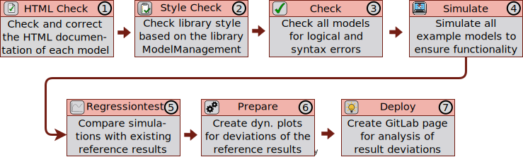

# Here you find the Documentation für CI Tests with AixLib
## What is CI?
Continuous integration is a term from software development that describes the process of continuously assembling components to form an application. 
The goal of continuous integration is to increase software quality.
Typical actions are translating and linking the application parts, but in principle any other operations to generate derived information are performed. 
Usually, not only the entire system is rebuilt, but also automated tests are performed and software metrics are created to measure software quality. 
The whole process is automatically triggered by checking into the version control system.

## CI commands  
| CI Command     | Description      | 
| :------------- | :-------------: | 
| `git commit -m "ci_create_model_wh"`          | create a whitelist with models that failed the check job         | 
| `git commit -m "ci_create_html_wh"`           | create a whitelist with models that should not go through the html check         | 
| `git commit -m "ci_create_example_wh"`           | create a whitelist with models that failed the simulate job         |
| `git commit -m "ci_simulate"`           | Simulate all examples         |
| `git commit -m "ci_check"`           | Check all models         |
| `git commit -m "ci_regression_test"`           | Start the regression test          |
| `git commit -m "ci_html"`           | Test only the html of models         |
| `git commit -m "ci_setting"`           | Test the CI settings         |
| `git commit -m "ci_trigger_ibpsa"`           | trigger IBPSA merge         |
| `git commit -m "ci_build_structure"`           | Build the CI structure         |
| `git commit -m " <<comit>> [skip ci]`           | Skip the CI pipeline       |

## What CI Tests are implemented?

1) The first stage is an HTML-check, which validates and corrects the HTML-code inside the annotation section of each model.
Any corrections are made via an automatically created new branch.
The user can subsequently review and merge the branch independently.
2) The Style-Check performs quality checks for each model using the Model Management Library of Dymola. Currently, this stage is allowed to fail for existing models, while new models will need to fulfill the requirements.
The following three stages are performed for all packages separately for easier error tracking. 
3) Check stage triggers triggers the Modelica Check function for all models. Any syntactic or logical errors (e.g. singularity of the system of equations) will cause this stage to fail. 
4) Simulate performs a simulation for all examples of AixLib. These are found based on the Modelica.Icons.Example icon.
Any non-successful simulation will cause this stage to fall.
5) Regressiontest is the final stage that verifies that the simulation results of models with existing reference results are in line with the prior results. 
The regressions are performed using the [BuildingsPy library](https://github.com/lbl-srg/BuildingsPy).
6) and 7)
Failed regression tests will trigger the preparation of dynamic plots and the deployment of an additional GitLab page, which will display the new and existing, i.e., reference, results based on [Google Charts](https://developers.google.com/chart).
